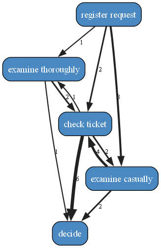
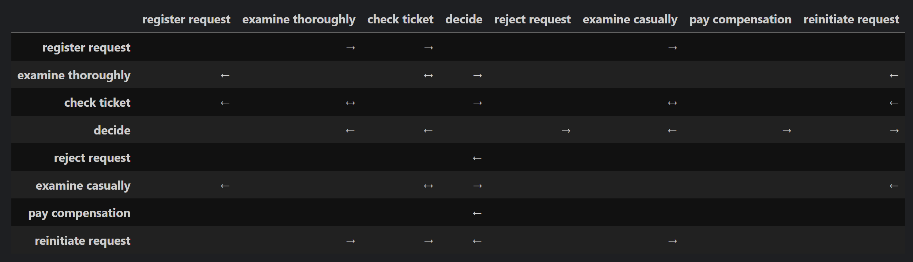
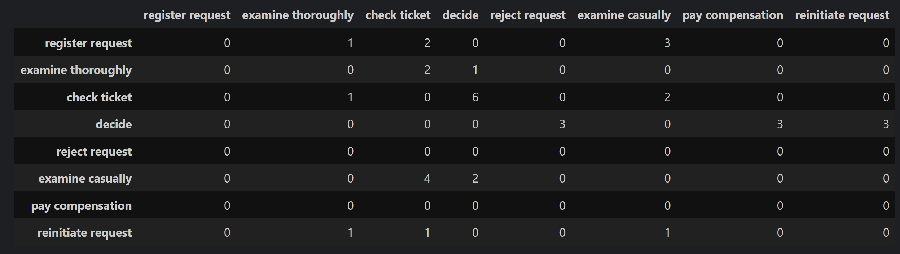

# ProcessMining
A set of free, open source process mining tools developed in python.
The images displayed here are based on the sample log files provided on [Link](https://promtools.org/prom-6-tutorial/introduction/)

## Application
Create a event log.
Define case identifier, event identifier, activity identifier and a split symbol.
Import the data from a csv file.
Afterwards apply a process discovery algorithm like the heuristic miner.
Here you can set the percentage of activities and paths that should be available in the output.
The visualization is done with GraphViz.
Example visualization done with the Heuristic miner:

In this example 100% of the nodes and 100% of the tasks have been used.
In this second example 70% of the nodes and all paths have been used.

By default the Heuristic miner uses the activity identifier of the event log.
By adjusting this activity identifier, we can also mine for resources.

## Data structures
The following data structures are utilized in the project:
 - Causual dependency matrix
 - Directly follows matrix
Both data structures can be created from a loaded event log.

